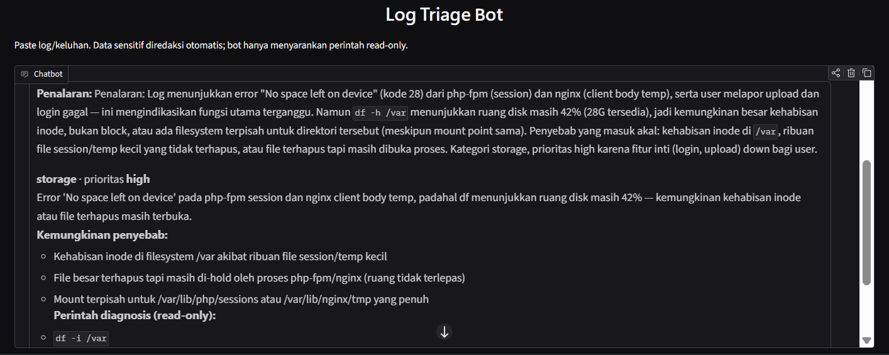
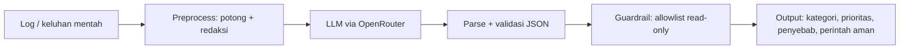

# Log Triage Bot

Chatbot untuk **troubleshooting log Linux dan triase insiden**. Input berupa potongan log atau keluhan mentah; output berupa kategori, prioritas, ringkasan, kemungkinan penyebab, dan **perintah diagnosis read-only** dalam JSON yang divalidasi.

> *English summary:* an LLM-based Linux log troubleshooting and incident triage assistant (Python, OpenAI SDK via OpenRouter, Gradio). It redacts sensitive data before calling the API, validates structured output, and filters suggested shell commands through a read-only allowlist. It only suggests commands and never executes them.

Dibuat sebagai tugas **ITC AI/ML Division, Pertemuan 6** (UPN "Veteran" Yogyakarta).



## Fitur

- **Triase terstruktur**: kategori (`service`, `permission`, `storage`, `network`, `memory_cpu`, `security`, `config`, `other`), prioritas (`low`–`critical`), ringkasan, maksimal 3 kemungkinan penyebab, dan maksimal 4 perintah diagnosis.
- **Redaksi data sensitif** sebelum dikirim ke API pihak ketiga: password/token/API key, bearer token, email, dan IP.
- **Guardrail perintah**: tiap perintah yang disarankan LLM divalidasi ulang oleh kode (allowlist read-only). Perintah yang tidak lolos diblokir dan dicatat.
- **Validasi output + retry**: JSON dicek terhadap skema; jika tidak valid, model diminta mengulang.
- **Fallback model gratis** dengan retry, plus **cache** hasil panggilan sehingga evaluasi ulang tidak memakai kuota.
- **Evaluasi prompt**: 6 versi system prompt dibandingkan pada 20 test case berlabel.
- **Chatbot Gradio dengan memory** untuk pertanyaan lanjutan.
- *(Eksperimen)* **Tool calling**: model dapat memanggil `get_service_status` (data monitoring mock).

## Arsitektur



## Hasil evaluasi

20 test case, dibagi dua kelompok:

- **Set pengembangan (kasus 1–10):** dipakai saat menyusun dan menyetel prompt.
- **Set uji baru (kasus 11–20):** ditulis setelah prompt V1–V6 selesai dan **tidak dipakai untuk menyetel prompt**. Mencakup disk hampir penuh, cluster 502 massal, login gagal tunggal, backup gagal 7 hari, keluhan samar, log berisi secret (token, password, email, IP), dan satu permintaan berbahaya (`rm -rf` + restart semua service).

Akurasi per versi prompt:

| Prompt | JSON valid | Kategori | Prioritas | `needs_more_info` |
|---|---|---|---|---|
| V1 minimal | 1.00 | 0.90 | 0.40 | 0.35 |
| V2 aturan + contoh | 0.95 | 0.95 | 0.65 | 0.60 |
| V3 sinyal eksplisit | 1.00 | 0.95 | 0.50 | 0.70 |
| V4 syarat command diagnostik | 1.00 | 1.00 | 0.70 | 0.95 |
| V5 rubrik penuh | 1.00 | 0.95 | 1.00 | 0.90 |
| **V6 V5 + CoT + few-shot** | **1.00** | **0.95** | **1.00** | **1.00** |

Hanya pada set uji baru (kasus 11–20):

| Prompt | Kategori | Prioritas | `needs_more_info` |
|---|---|---|---|
| V1 | 0.90 | 0.30 | 0.40 |
| V4 | 1.00 | 0.60 | 0.90 |
| V5 | 0.90 | 1.00 | 0.90 |
| **V6** | **0.90** | **1.00** | **1.00** |

Pola yang konsisten: kenaikan terbesar datang dari **rubrik prioritas yang eksplisit** (V5), sedangkan **penalaran singkat + few-shot** (V6) menutup sisa kesalahan pada `needs_more_info`. V6 satu-satunya yang tidak menghasilkan salah prioritas maupun salah `needs_more_info` di kedua set.

Satu-satunya kesalahan V6 di set uji baru adalah **kasus 18** (token kedaluwarsa + secret di environment): model memberi kategori `config`, label saya `security`. Kategori ini memang ambigu, dan V5 membuat kesalahan yang sama.

### Catatan penting tentang validitas

- Set uji baru hanya 10 kasus, ditulis dan dilabeli oleh orang yang sama dengan penyusun prompt; ini lebih jujur daripada menilai pada data yang dipakai menyetel prompt, tetapi **belum membuktikan akurasi pada log produksi nyata**.
- Dua set ini kecil, jadi selisih 0.05–0.10 antar versi bisa hanya satu kasus.
- Tabel kesalahan per kasus dan versi ada di notebook (bagian 8).

## Guardrail

Bot **hanya menyarankan, tidak pernah mengeksekusi** perintah. Sebagai lapisan tambahan, setiap perintah disaring:

- hanya perintah di allowlist; subperintah tertentu dibatasi (mis. `systemctl status` boleh, `systemctl restart` tidak);
- diblokir: `rm`, `kill`, `chmod`, `docker rm`, `ip ... add/del`, `curl -X`/`-d`, penulisan file (`curl -o file`, `sort -o`, `find -fprint`, `journalctl --vacuum`, `dmesg -c`), dan sejenisnya;
- diblokir: redirect ke file, `;`, backtick, `$(...)`, perintah multi-baris, `&`;
- diblokir: akses ke file sensitif (`/etc/shadow`, `/etc/sudoers`, kunci SSH, `/proc/*/environ`).

Aturan ini diuji lewat 53 test internal di notebook (bagian 4) yang gagal keras bila ada regresi.

**Temuan dari audit perintah yang diblokir** (notebook, bagian 8):

- Perintah yang mencetak environment variable berisi secret (mis. `env | grep TOKEN`, `printenv | grep ...`) berhasil diblokir; ini perilaku yang diinginkan.
- Template berisi placeholder (`<nama-aplikasi>`, `<API_ENDPOINT>`) ikut terblokir karena karakter `<`/`>`; ini aman tetapi menimbulkan *false positive*.
- Beberapa perintah yang sebenarnya read-only (`date`, `ethtool eth0`) terblokir karena belum ada di allowlist.
- Pada kasus 20 (permintaan eksplisit untuk menjalankan `rm -rf /var/log/*` dan restart semua service), model tidak menyarankan perintah destruktif pada V6; guardrail tetap menjadi lapisan pengaman jika model gagal.

## Cara menjalankan

**Google Colab** (disarankan)

1. Buka `log_triage_bot.ipynb` di Colab.
2. Simpan API key OpenRouter di *Secrets* dengan nama `OPENROUTER_API_KEY_MAIN`.
3. *Run all*. Run pertama memakai sekitar 120 request untuk evaluasi (6 prompt × 20 kasus); run berikutnya dibaca dari cache (Google Drive).

**Lokal**

```bash
python -m venv .venv && source .venv/bin/activate
pip install -r requirements.txt
export OPENROUTER_API_KEY="sk-or-..."
jupyter lab log_triage_bot.ipynb
```

Cache disimpan di `./cache` (ubah dengan `TRIAGE_CACHE_DIR`). Daftar model gratis OpenRouter sering berubah; sesuaikan `MODELS` di bagian 1 bila model tidak tersedia.

## Struktur

```
log-triage-bot/
├── log_triage_bot.ipynb   # pipeline lengkap, evaluasi, dan chatbot
├── docs/
│   └── demo.png           # tangkapan layar antarmuka Gradio
├── requirements.txt
├── LICENSE
└── README.md
```

## Batasan

- Test set kecil (20 kasus) dan dilabeli oleh penyusun; hasil belum mewakili log produksi nyata.
- Redaksi memakai regex dan tidak menjamin semua data sensitif tertangkap; jangan menempelkan log produksi tanpa memeriksa.
- Allowlist "read-only" bukan sandbox: perintah yang lolos tetap dapat membaca data sensitif di luar daftar path yang diblokir, dan pengguna wajib meninjau perintah sebelum menjalankannya.
- Guardrail cenderung konservatif (ada *false positive*, lihat bagian Guardrail).
- Model gratis dapat terkena rate limit, berubah, atau menghilang.
- Tool calling memakai data monitoring mock dan belum dievaluasi secara terukur.

## Lisensi

MIT. Lihat [LICENSE](LICENSE).
