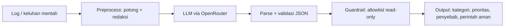

# Log Triage Bot

Chatbot untuk **troubleshooting log Linux dan triase insiden**. Input berupa potongan log atau keluhan mentah; output berupa kategori, prioritas, ringkasan, kemungkinan penyebab, dan **perintah diagnosis read-only** dalam JSON yang divalidasi.

> *English summary:* an LLM-based Linux log troubleshooting and incident triage assistant (Python, OpenAI SDK via OpenRouter, Gradio). It redacts sensitive data before calling the API, validates structured output, and filters suggested shell commands through a read-only allowlist. It only suggests commands and never executes them.

Dibuat sebagai tugas **ITC AI/ML Division, Pertemuan 6** (UPN "Veteran" Yogyakarta).


## Fitur

- **Triase terstruktur**: kategori (`service`, `permission`, `storage`, `network`, `memory_cpu`, `security`, `config`, `other`), prioritas (`low`–`critical`), ringkasan, maksimal 3 kemungkinan penyebab, dan maksimal 4 perintah diagnosis.
- **Redaksi data sensitif** sebelum dikirim ke API pihak ketiga: password/token/API key, bearer token, string hex/panjang, email, dan IP.
- **Guardrail perintah**: tiap perintah yang disarankan LLM divalidasi ulang oleh kode (allowlist read-only). Perintah yang tidak lolos diblokir dan dicatat.
- **Validasi output + retry**: JSON dicek terhadap skema; jika tidak valid, model diminta mengulang.
- **Fallback model gratis** dengan retry, plus **cache** hasil panggilan sehingga evaluasi ulang tidak memakai kuota.
- **Evaluasi prompt**: 6 versi system prompt dibandingkan pada 10 test case berlabel.
- **Chatbot Gradio dengan memory** untuk pertanyaan lanjutan.
- *(Eksperimen)* **Tool calling**: model dapat memanggil `get_service_status` (data monitoring mock).

## Arsitektur



## Hasil evaluasi

10 test case (service, permission, storage, memory, security, network, config, kasus samar). Metrik rata-rata per versi prompt:

| Prompt | JSON valid | Akurasi kategori | Akurasi prioritas | Akurasi `needs_more_info` | Perintah terblokir* |
|---|---|---|---|---|---|
| V1 minimal | 1.0 | 0.9 | 0.5 | 0.3 | 2 |
| V2 aturan + contoh | 0.9 | 0.9 | 0.7 | 0.6 | 0 |
| V3 sinyal eksplisit | 1.0 | 0.9 | 0.5 | 0.7 | 1 |
| V4 syarat command diagnostik | 1.0 | 1.0 | 0.8 | 1.0 | 0 |
| V5 rubrik penuh | 1.0 | 1.0 | 1.0 | 0.9 | 0 |
| V6 V5 + CoT + few-shot | 1.0 | 1.0 | 1.0 | 1.0 | 0 |

\* Dihitung dengan versi awal guardrail, sebelum diperketat; jalankan ulang evaluasi untuk angka terbaru.

**Catatan jujur:** V6 dituning pada 10 kasus yang sama dengan yang dipakai menilainya, sehingga 100% adalah hasil *in-sample* pada sampel kecil, bukan bukti akurasi di data nyata. Analisis kesalahan per versi ada di notebook (bagian 8).

## Guardrail

Bot **hanya menyarankan, tidak pernah mengeksekusi** perintah. Sebagai lapisan tambahan, setiap perintah disaring:

- hanya perintah di allowlist; subperintah tertentu dibatasi (mis. `systemctl status` boleh, `systemctl restart` tidak);
- diblokir: `rm`, `kill`, `chmod`, `docker rm`, `ip ... add/del`, `curl -X`/`-d`, penulisan file (`curl -o file`, `sort -o`, `find -fprint`, `journalctl --vacuum`, `dmesg -c`), dan sejenisnya;
- diblokir: redirect ke file, `;`, backtick, `$(...)`, perintah multi-baris, `&`;
- diblokir: akses ke file sensitif (`/etc/shadow`, `/etc/sudoers`, kunci SSH, `/proc/*/environ`).

Aturan ini diuji lewat test internal di notebook (bagian 4) yang gagal keras bila ada regresi.

## Cara menjalankan

**Google Colab** (disarankan)

1. Buka `log_triage_bot.ipynb` di Colab.
2. Simpan API key OpenRouter di *Secrets* dengan nama `OPENROUTER_API_KEY_MAIN`.
3. *Run all*. Run pertama memakai sekitar 60 request untuk evaluasi; run berikutnya dibaca dari cache (Google Drive).

**Lokal**

```bash
python -m venv .venv && source .venv/bin/activate
pip install -r requirements.txt
export OPENROUTER_API_KEY="sk-or-..."
jupyter lab log_triage_bot.ipynb
```

Cache disimpan di `./cache` (ubah dengan `TRIAGE_CACHE_DIR`). Daftar model gratis OpenRouter sering berubah; sesuaikan `MODELS` di bagian 1 bila model tidak tersedia.

## Struktur

```
log-triage-bot/
├── log_triage_bot.ipynb   # pipeline lengkap, evaluasi, dan chatbot
├── requirements.txt
├── LICENSE
└── README.md
```

## Batasan

- Test set kecil (10 kasus) dan prompt dituning pada set yang sama.
- Redaksi memakai regex dan tidak menjamin semua data sensitif tertangkap; jangan menempelkan log produksi tanpa memeriksa.
- Allowlist "read-only" bukan sandbox: perintah yang lolos tetap dapat membaca data sensitif di luar daftar path yang diblokir, dan pengguna wajib meninjau perintah sebelum menjalankannya.
- Model gratis dapat terkena rate limit, berubah, atau menghilang.
- Tool calling memakai data monitoring mock dan belum dievaluasi secara terukur.

## Lisensi

MIT. Lihat [LICENSE](LICENSE).
